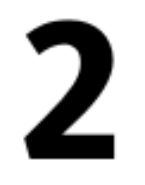

= Create Mobile Data Collection Applications
:author: Benson Muite
:encoding: utf-8
:lang: en
:rev: 0.5.0
:revdate: 2026-08-27
:pdf-page-layout: landscape
:source-highlighter: rouge
:stylesheet: slides.css
:sectnums!:
:nofooter!: 
:pagenums: yes
:skip-front-matter: no
:noheader: yes
:notitle:
:pdf-page-size: [6.575625in,11.69in]
:figure-caption!:
page:
  layout: landscape

[#0] 
== Create Mobile Data Collection Applications
<<8,ˇ>><<1,»>>

[discrete]
=== Benson Muite

{empty} +
{empty} +
{empty} +

Typeset by https://asciidoctor.org[AsciiDoctor] using https://www.intel.com/content/www/us/en/company-overview/one-monospace-font.html[Intel® One Mono Fonts]

https://www.gnu.org/licenses/fdl-1.3.en.html#license-text[GFDL-1.3-or-later]

<<<

[#1]
== Outline
<<0,«>><<2,»>>

[disc]
* Motivation
* LambdaNative
* Demos
* Further Work

<<<

[#2]
== Motivation
<<1,«>><<3,»>>

[disc]
* Mobile phones and tablets widespread
* Creating mobile applications can be challenging
* Data collection typically requires a few patterns
* Use a framework that has these patterns

<<<

[#3]
== LambdaNative
<<2,«>><<4,»>>

[disc]
* https://lambdanative.org[LambdaNative website]
* Open source available under BSD-3-Clause license
* Openly developed
* Built using https://gambitscheme.org/[Gambit Scheme]
* Current focus is on Android applications, but iOS and desktop applications are also possible
* Can be ported to new operating systems
* Work required to improve accessibility
* https://github.com/bkmgit/scheme-novice[Introduction to Scheme] and https://github.com/bkmgit/create-and-distribute-an-app-on-fdroid[Introduction to F-Droid]

<<<
 
[#4]
== Example Applications
<<3,«>><<5,»>>

[disc]
* https://github.com/anmsajedulalam/Lamda-Native-Framework-based-App-with-Knowledge-Distillation-based-Rice-Leaf-Disease-Classifier[Rice leaf disease classifier] by https://github.com/anmsajedulalam[A. N. M. Sajedul Alam]
* https://github.com/rabsss/GeoTrace[GPS location logging] by https://github.com/rabsss[Rabina Poudyal]
* https://github.com/BonfaceNjuguna/LambdaNativeQuickStart[Expense Tracker] by https://github.com/BonfaceNjuguna[Bonface Njuguna]
* https://github.com/AgoeZero/tomato[Tomato leaf disease classifier] by https://github.com/AgoeZero[AgoeZero]
* https://github.com/Amor-art/Lipabill[Small business payment reconcilliation] by https://github.com/Amor-art[Amor-art]

<<<

[#5]
== Application libraries to be incorporated
<<4,«>><<6,»>>

[disc]
* https://github.com/gambiteer/EndlessBits[Multiprecision calculations] by https://github.com/gambiteer[Bradley Lucier]
* https://github.com/part-cw/lambdanative/tree/master/modules/genann[GENANN] by https://github.com/AgoeZero[AgoeZero]
* https://github.com/Nyanyan/Egaroucid[Egaroucid - Othello AI engine] by https://github.com/Nyanyan[Takuto Yamana]

<<<

[#6]
== Demos
<<5,«>><<7,»>>

[disc]
* https://github.com/bkmgit/Msongomano[Manual traffic recording]
* https://github.com/part-cw/lambdanative/tree/master/apps/DemoQRScan[Read generated QR code]: https://www.nayuki.io/page/qr-code-generator-library[Online QR code generator]
* https://github.com/bkmgit/lambdanative/tree/tinymaix/apps/DemoDigitDetect[Digit detection]

.Image of the number 2

<<<

[#7]
== Summary
<<6,«>><<8,»>>

[disc]
* LambdaNative is a framework that is useful for creating mobile applications
* Community can be improved
* LambdaNative applications are easy to develop
* LambdaNative applications run on a wide range of devices, in particular low end smart phones

<<<

[#8]
== Further work
<<7,«>><<9,»>>

[disc]
* Improve app accessibility
* Work on file system permissions
* Create traffic counting app that will work on Android and use Yolo model

<<<

[#9]
== Acknowledgements
<<8,«>><<0,^>>

* https://nlnet.nl/[NLnet]
* All LambdaNative contributors and maintainers
* https://eplghana.org/[Emerging Public Leaders Ghana] for https://bkmgit.github.io/2025-06-07-epl-online/[Workshop testing]
* https://www.research-software-africa.org[RSAfrica 2026]

